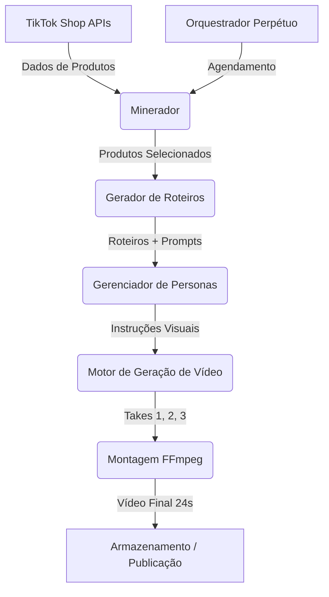

# Arquitetura do Pipeline Perpétuo UGC TikTok Shop

## Visão Geral
O Pipeline Perpétuo é um sistema autônomo projetado para gerar continuamente vídeos UGC de alta conversão para o TikTok Shop Brasil. Ele integra mineração de produtos em alta, geração de roteiros persuasivos (dor → solução → CTA), renderização de avatares consistentes (6 personas) e montagem final de vídeos de 24 segundos divididos em 3 takes.

## Objetivos
1. **Automação Total**: Funcionar 24/7 sem intervenção manual.
2. **Escalabilidade**: Suportar múltiplos produtos e nichos simultaneamente.
3. **Conversão**: Utilizar frameworks comprovados de storytelling e UGC para maximizar o ROI.
4. **Consistência Visual**: Manter a mesma persona, cenário e roupa do início ao fim do vídeo.

## Componentes Principais

### 1. Minerador de Produtos (`tiktokMiner.ts` / `tiktokScraper.ts`)
- **Função**: Buscar os produtos mais vendidos e em alta no TikTok Shop.
- **Integração**: Utiliza APIs de dados (como Apify ou FastMoss) para coletar métricas de vendas, GMV e engajamento.
- **Critérios de Seleção**: Produtos com alto volume de vendas recentes, boa margem para afiliados e forte apelo visual.

### 2. Gerador de Roteiros (`scriptEngine.ts` / `gc_roteiro_gen.py`)
- **Função**: Criar roteiros de 24 segundos otimizados para conversão.
- **Framework**: Vontade/Dor (0-8s) → Solução/Urgência (8-16s) → CTA (16-24s).
- **Variações**: Gera roteiros específicos para cada uma das 6 personas, adaptando o tom de voz e os ângulos de venda.

### 3. Gerenciador de Personas (`AI Character Studio`)
- **Função**: Manter a consistência visual dos avatares gerados por IA.
- **Personas (6 Arquétipos)**:
  1. *A Especialista*: Foco em ingredientes, dados e confiança (ex: dermatologista, nutricionista).
  2. *A Usuária Comum*: Relatável, mostra a transformação na prática (ex: dona de casa, estudante).
  3. *O Comparador*: Cético que testa e aprova, focando no antes/depois.
  4. *A Influenciadora de Estilo*: Foco em estética, tendências e status.
  5. *O Solucionador de Problemas Práticos*: Direto ao ponto, foca na utilidade.
  6. *A Mãe Prática*: Foco em economia de tempo, segurança e custo-benefício.
- **Implementação**: Prompts de imagem base fixos (seed, estilo, iluminação) para garantir que a mesma pessoa apareça nos 3 takes.

### 4. Motor de Geração de Vídeo (`gc_pipeline.py` / `gc_video_composer.py`)
- **Função**: Renderizar os takes e montar o vídeo final.
- **Processo**:
  - **Take 1 (Problema)**: Gera vídeo da persona relatando a dor.
  - **Take 2 (Solução)**: Gera vídeo da persona demonstrando o produto (3 ângulos diferentes gerados e intercalados ou usados em vídeos distintos).
  - **Take 3 (CTA)**: Gera vídeo da persona fazendo a chamada para ação.
- **Áudio**: Lip-sync nativo usando TTS de alta qualidade.
- **Montagem**: Concatenação via FFmpeg com textos nativos estilo TikTok e trilha sonora de fundo.

### 5. Orquestrador Perpétuo (`cron` / `jobQueue.ts`)
- **Função**: Agendar e gerenciar o fluxo de trabalho contínuo.
- **Fluxo**:
  1. A cada X horas, o Minerador busca N novos produtos.
  2. Para cada produto, o Gerador de Roteiros cria M variações (usando diferentes personas).
  3. O Motor de Vídeo renderiza e monta os vídeos.
  4. Os vídeos finais são salvos em um diretório ou enviados para aprovação/publicação automática.

## Fluxo de Dados

## Próximos Passos para Implementação
1. **Consolidar Personas**: Definir os prompts exatos e imagens de referência para as 6 personas.
2. **Integrar Mineração**: Conectar o script de mineração com a API de dados reais.
3. **Automatizar Pipeline**: Criar o script mestre que une mineração, roteirização, geração e montagem em um loop contínuo.
4. **Deploy em Nuvem**: Configurar o ambiente em um servidor persistente (Cloud Computer) para execução 24/7.
