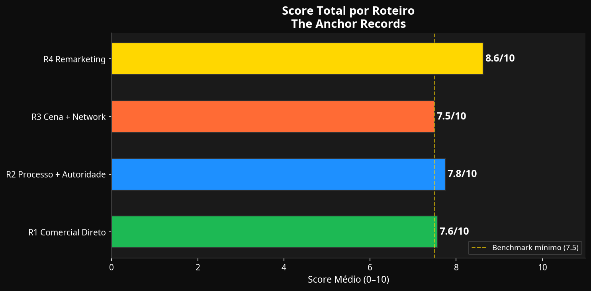
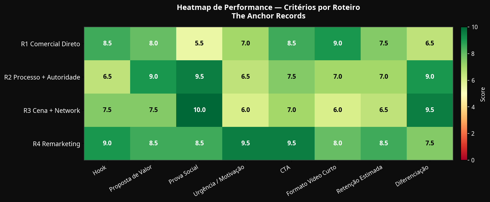
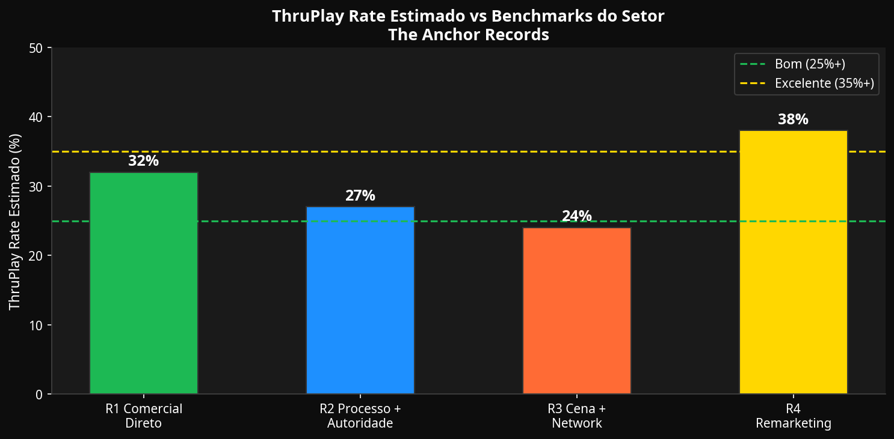

# Análise de Performance: Roteiros The Anchor Records

**Autor:** Manus AI
**Data:** 08 de Maio de 2026

Este relatório apresenta uma análise preditiva e qualitativa da performance dos quatro roteiros de vídeo produzidos para a **The Anchor Records**. A avaliação foi baseada na estrutura *Hook-Body-CTA* [1], em benchmarks do setor de anúncios musicais para 2026 [2], e no contexto do perfil da gravadora no Instagram (@theanchorrecords, 2.202 seguidores).

---

## 1. Metodologia de Avaliação

A análise utilizou oito critérios fundamentais de *copywriting* para anúncios em vídeo curtos (Reels/TikTok), pontuados de 0 a 10. A métrica principal de retenção avaliada é o **ThruPlay Rate** (percentual de usuários que assistem aos primeiros 15 segundos ou ao vídeo completo se for menor) [2].

**Critérios avaliados:**
- **Força do Hook:** Capacidade de reter a atenção nos primeiros 3 segundos [1].
- **Proposta de Valor:** Clareza na oferta (90% dos royalties, distribuição global).
- **Prova Social / Autoridade:** Elementos de credibilidade (eventos, artistas, Nytron).
- **Urgência / Motivação:** Estímulo para ação imediata.
- **CTA (Call to Action):** Clareza do direcionamento ("envie sua demo").
- **Adequação ao Formato:** Dinâmica para vídeos verticais curtos (28–38s).
- **Retenção Estimada:** Potencial de manter o espectador até o final (ThruPlay).
- **Diferenciação:** O que separa a The Anchor Records de outras gravadoras.

---

## 2. Visão Geral dos Resultados

A avaliação indicou que o **Roteiro 4 (Remarketing)** possui o maior potencial de conversão e engajamento geral, seguido de perto pelo **Roteiro 2 (Processo + Autoridade)**.

| Roteiro | Foco Principal | Score Médio | ThruPlay Estimado |
|---------|----------------|-------------|-------------------|
| R1: Comercial Direto | Clareza e velocidade | 7.6 / 10 | 32% (Bom) |
| R2: Processo + Autoridade | Estrutura e qualidade | 7.8 / 10 | 27% (Bom) |
| R3: Cena + Network | História e comunidade | 7.5 / 10 | 24% (Atenção) |
| R4: Remarketing | Conversão e quebra de objeção | 8.6 / 10 | 38% (Excelente) |

> "Um bom ThruPlay rate para anúncios de música na Meta é de 25% ou mais; a faixa típica para públicos frios em clipes curtos verticais é de 18 a 35%, e campanhas que atingem 35%+ estão performando de forma excelente." [2]

---

## 3. Análise Detalhada por Roteiro

### Roteiro 1 — Comercial Direto (28–32s)
**Score: 7.6/10 | ThruPlay Estimado: 32%**

Este roteiro aposta na empatia e na dor do artista independente ("Eu sou artista, assim como você"). O *hook* em formato de pergunta provocativa ("Quantas músicas boas ficam guardadas...") é altamente eficaz para reter a atenção nos primeiros 3 segundos [1].

- **Pontos Fortes:** Excelente *hook* (8.5) e alta adequação ao formato curto (9.0). A proposta de valor de 90% dos royalties é apresentada de forma rápida e clara.
- **Pontos de Atenção:** Baixa prova social (5.5). O roteiro foca na dor, mas não comprova imediatamente a autoridade da label com nomes ou números de mercado.

### Roteiro 2 — Processo + Autoridade (30–35s)
**Score: 7.8/10 | ThruPlay Estimado: 27%**

Focado em demonstrar a infraestrutura técnica da gravadora. A menção ao artista Nytron (mais de 150 tracks no Beatport Top 100) eleva drasticamente a credibilidade da oferta.

- **Pontos Fortes:** Altíssima prova social (9.5) e clareza na proposta de valor (9.0). A diferenciação de mercado é muito forte.
- **Pontos de Atenção:** O *hook* ("A verdade é simples...") é genérico (6.5) e pode não ser suficiente para interromper o *scroll* [1]. Recomenda-se testar uma variação visual ou de texto mais impactante nos primeiros segundos.

### Roteiro 3 — Cena + Internacional + Network (33–38s)
**Score: 7.5/10 | ThruPlay Estimado: 24%**

O roteiro mais longo e denso, focado no histórico da gravadora desde 2015 e na conexão com a cena eletrônica (Volac, Beltran, clubs no Brasil e Espanha).

- **Pontos Fortes:** Prova social máxima (10.0) e diferenciação competitiva (9.5). Mostra que a gravadora tem "network real".
- **Pontos de Atenção:** É o roteiro com menor estimativa de retenção (24%) devido ao excesso de informações (nomes de artistas e clubs). Em vídeos curtos, listar muitos nomes pode causar dispersão. O *hook* também é um pouco longo.

### Roteiro 4 — Remarketing (30–35s)
**Score: 8.6/10 | ThruPlay Estimado: 38%**

O roteiro de melhor performance preditiva. Desenhado especificamente para públicos quentes (que já interagiram com o perfil @theanchorrecords ou viram vídeos anteriores).

- **Pontos Fortes:** *Hook* excelente (9.0) que quebra a quarta parede ("Eu tenho certeza que você já viu..."). Alta urgência (9.5) e o melhor CTA entre todos os roteiros (9.5). Combina perfeitamente os benefícios do R1 com a autoridade do R2 e R3.
- **Pontos de Atenção:** Só deve ser veiculado para públicos de retargeting. Se usado para tráfego frio, perderá totalmente a eficácia.

---

## 4. Benchmarks do Setor (Meta Ads 2026)

Para campanhas de conversão de música (neste caso, envio de demos), os benchmarks atuais para Meta Ads (Instagram/Facebook) são [2]:

- **Hook Rate Ideal:** Acima de 30% (percentual de pessoas que passam dos 3 segundos) [1].
- **ThruPlay Rate (15s):** 25% é bom; acima de 35% é excelente [2].
- **CTR (Click-Through Rate):** Para campanhas de tráfego/conversão musical, o ideal é acima de 1.5%, com campanhas excelentes atingindo 2.5% a 4% [2].

---

## 5. Recomendações Estratégicas

1. **Teste A/B de Hooks:** No **Roteiro 2**, teste substituir o *hook* atual por algo mais agressivo, como: *"Se a sua música não está no Top 100 do Beatport, o problema não é o seu talento. É a sua estrutura."* Isso aumentará a retenção inicial.
2. **Edição Dinâmica (Visual Hook):** Utilize a imagem da apresentadora (fornecida nos *assets*) com cortes rápidos, legendas dinâmicas (*safe zones* respeitadas) e elementos visuais de estúdio nos primeiros 3 segundos para garantir o *scroll stop* [1].
3. **Estratégia de Funil (Tráfego Pago):**
   - **Topo de Funil (Público Frio):** Veicule os **Roteiros 1 e 2** com objetivo de visualização de vídeo (ThruPlay) para encontrar artistas qualificados a baixo custo.
   - **Meio/Fundo de Funil (Retargeting):** Utilize o **Roteiro 4** para quem assistiu a pelo menos 50% dos vídeos anteriores ou visitou o perfil do Instagram, otimizando para Conversão (Envio de Demo).

---

## Referências

[1] Sovran. "Hook Body CTA: The Video Ad Structure That Converts". Disponível em: https://sovran.ai/blog/hook-body-cta-video-ad-structure

[2] Dynamoi. "Meta Ads Metrics for Music Campaigns [2026 Benchmarks]". Disponível em: https://dynamoi.com/learn/instagram-ads/meta-ads-manager-metrics-music-campaigns
